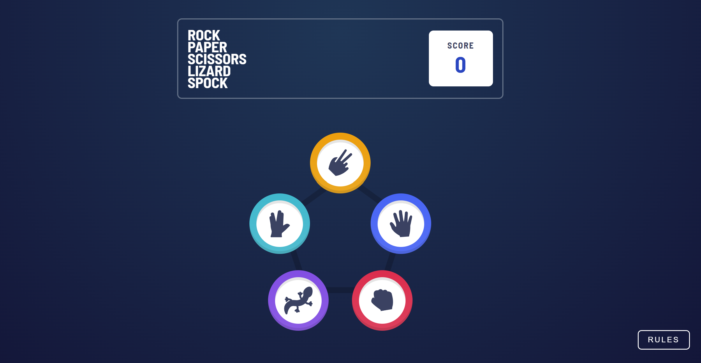
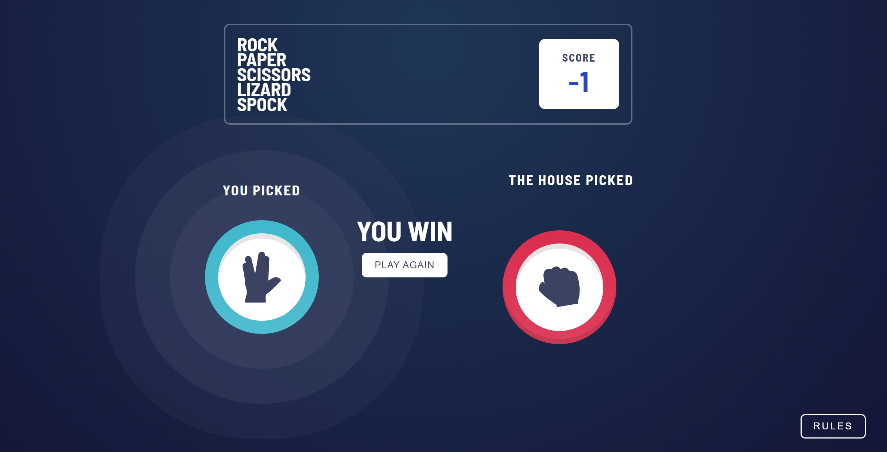

# Rock, Paper, Scissors, Lizard, Spock

This is a solution to the [Rock, Paper, Scissors challenge on Frontend Mentor](https://www.frontendmentor.io/challenges/rock-paper-scissors-game-pTgwgvgH). Frontend Mentor challenges help you improve your coding skills by building realistic projects.

## Table of contents

-   [Overview](#overview)
    -   [The challenge](#the-challenge)
    -   [Screenshot](#screenshot)
-   [My process](#my-process)
    -   [Built with](#built-with)

## Overview

### The challenge

Users should be able to:

-   View the optimal layout for the game depending on their device's screen size
-   Play Rock, Paper, Scissors, Lizard, Spock against the computer.
-   See a winner message after each round.

### Screenshot

## My process

### Built with

-   Semantic HTML5 markup
-   SCSS
-   Flexbox
-   CSS Grid
-   Media queries
